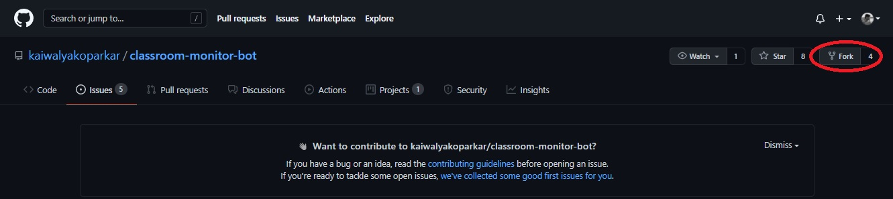
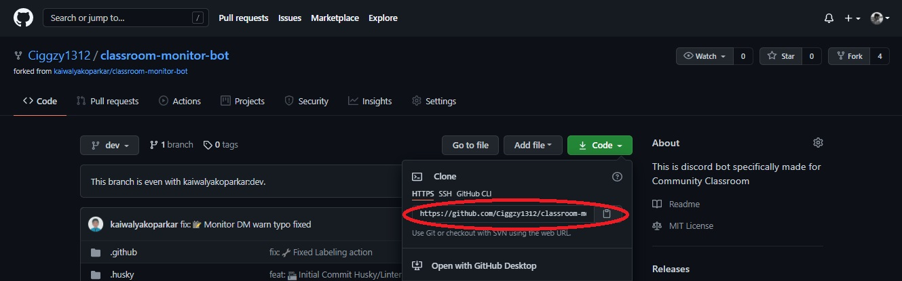
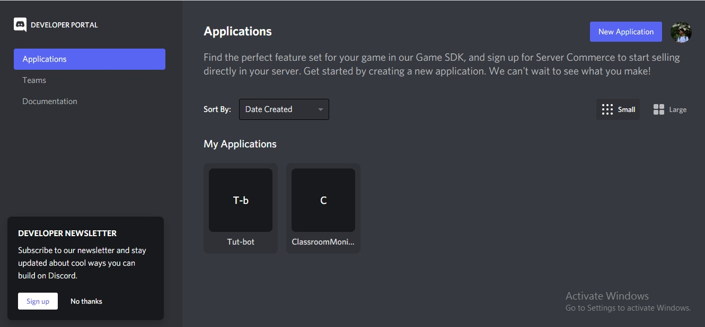
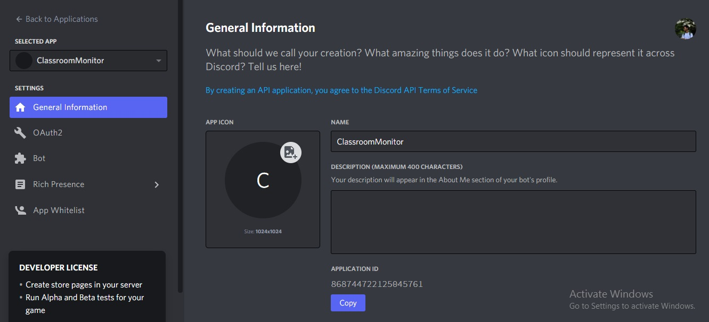
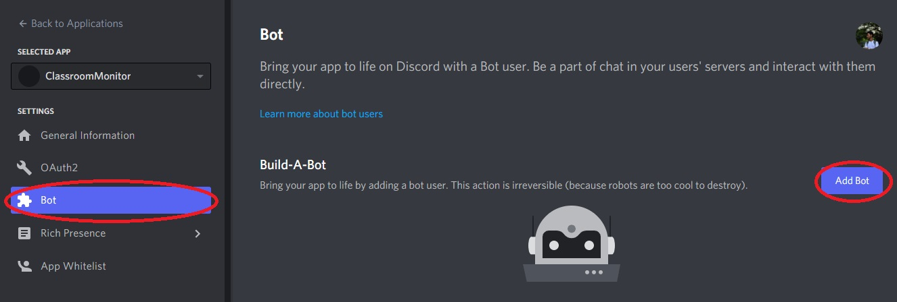
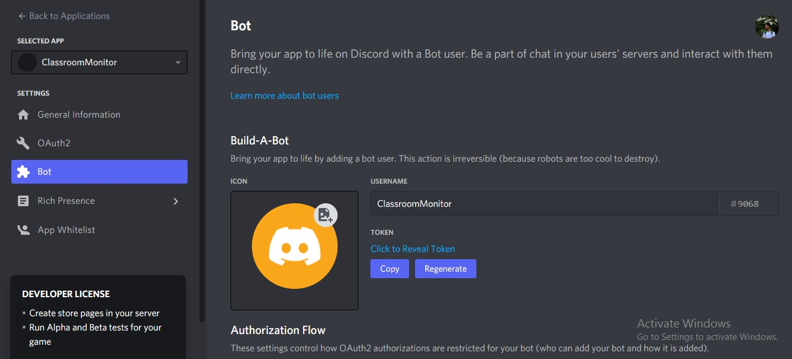
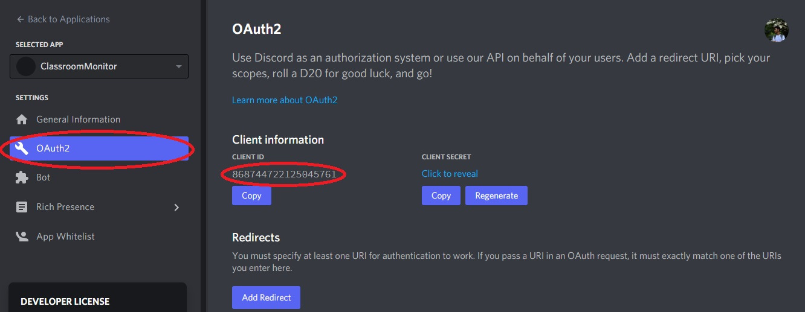
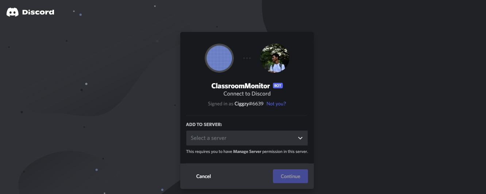
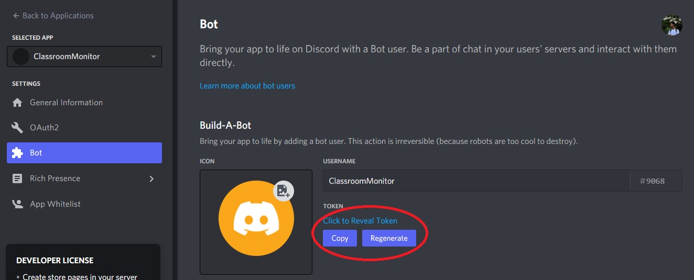

<h1 align="center"> Classroom Monitor Bot </h1>

  <b>This bot provides functionalities for 'Community Classroom' discord server.</b>   
  <b>Community Classroom is an initiative 'for the students, by a student'. The initiative aims to provide 'quality education which is free for all'.</b>   
  <b>Follow us and be a part of this amazing community.</b>   
  &ensp;
  &ensp;
  &ensp;
  &ensp;
  &ensp;
   

  

## About :

We believe that every student, irrespective of their college or branch, can make it big. Community Classroom is an initiative built on this thought. We provide hands-on training, mentorship and have an inclusive community. All of our courses are FREE and better than most paid courses. We cover every topic in detail and mentor you to stand out and get opportunities by breaking all the barriers. Get expert guidance with career, Open Source, and internships, jobs around the world.

## Note to all contributors
Thank you for putting your time to contribute and helping others out.
Before contributing do kindly read and follow [Code of conduct](./CODE_OF_CONDUCT.md)
To get started with contributing go through the following steps

## Prerequisites

### System requirement

1. Any system with basic configuration.
2. Operating System : Windows / Linux / Mac

### Software requirement

1. Node.js installed (If not download it [here](https://nodejs.org/en/download/)).
2. Any text editor of your choice.
3. Discord account and a discord server where you have admin access

### Skill requirement

1. Knowledge of git & github.
2. JavaScript
3. [NodeJS](https://nodejs.org/en/)
4. [expressJS](https://expressjs.com/)

## Setting up Locale Environment

### Forking repository

1. Firstly to make your own copy of the project you have to fork the repository. To fork the repository press the fork button. In case of any difficulty refer to the image below
    

### Clone repository

1. Now after you have forked your project its time to clone it into your local device so that you can work on it
2. In your forked repository click on the green code button and copy the provided link. In case of any difficulty refer to the image below
    
3. Now in your desktop open `git bash` and type `git clone <your-clone-url>.git` and press enter
4. Now, your forked repo has been cloned in your device 

## Contributing

Before starting make sure you have developer mode enabled in your discord
If not then got to `Settings > Advanced > Developer Mode: ON`

### Creating a branch

Whenever you want to contribute to any project it is a good practice to make a separate branch and push it as PR rather than making changes to the main/master branch

1. `git branch -b <your-branch-name>` will make a separate branch and will take you to it
2. Now you are ready to make your desired changes

### Setting up application and creating bot

1. First visit [here](https://discord.com/developers/applications/)
2. Login with your discord credentials and will see the screen(image below and for you it will probably be a blank one)
    
3. Now click the `New Application` button(refer to image above)
4. Name your bot and press `create` 
5. Now you will appear at the application dashboard where you can customize your bot(refer to image below)
    
6. Now to create your bot instance go to `Bot` tab and press`Add Bot` followed by `Yes,do it` in the following popup(refer to image below)
    
7. Now you will appear to this screen(image below)
    
8. Go to `OAuth2` and copy the client id(refer to image below)
    
9. Now to invite the bot to your server, paste this link in your browser `https://discord.com/api/oauth2/authorize?client_id=<app-id>&permissions=8&scope=bot` and just replace `<app-id>` with your copied client id
10. Now you will be redirected to this screen(image below) where you have to select a server and click on `continue` and `authorize` after that
    

##### Now your bot will be added to your server but it is still offline. So let's start...

### Coding our Bot

1. Open the folder of your cloned repository with any text editor of your choice
2. Now go to developers portal where you created the bot and copy the bot token from `Bot` tab(refer to image below)
    
3. Now create a `.env` file in your root folder and copy everything from `.env-sample` file and replace the `BOT-TOKEN` value with the copied token
4. In the terminal run `npm install`, this will install all the packages
5. Then to start our server run `npm start`, this will start our server and the bot will be online

## Commands Supported : 

#### `cm!help` - Helps with the commands and features what the bot offers.
#### `cm!hey` - Says 'Hey' to the user.
#### `cm!version` - Displays the current running version of the bot.
#### `cm!links` - Displays all the social accounts of the community.

This bot is reserved for functionalities offered for community classroom community.

### Maintainer :

[Kaiwalya Koparkar](https://github.com/kaiwalyakoparkar)
