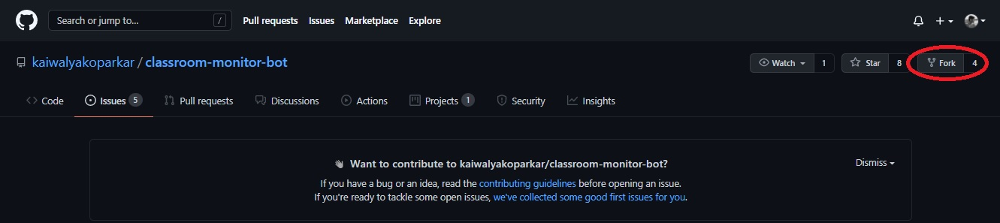
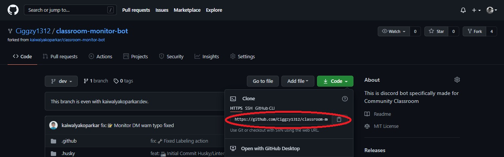

# Classroom Monitor Bot
This bot is reserved for functionalities offered for community classroom community.

## Note to all contributors
Thank you for putting your time to contribute and helping others out.
Before contributing do kindly read and follow [Code of conduct](./CODE_OF_CONDUCT.md)
To get started with contributing go through the following steps

## Prerequisites

### System requirement

1. Any system with basic configuration.
2. Operating System : Windows / Linux / Mac

### Software requirement

1. Node.js installed (If not download it [here](https://nodejs.org/en/download/)).
2. Any text editor of your choice.
3. Discord account and a discord server where you have admin access

### Skill requirement

1. Knowledge of git & github.
2. JavaScript
3. [NodeJS](https://nodejs.org/en/)
4. [expressJS](https://expressjs.com/)

### Maintainer :

[Kaiwalya Koparkar](https://github.com/kaiwalyakoparkar)

## Setting up Locale Environment

### Forking repository

1. Firstly to make your own copy of the project you have to fork the repository. To fork the repository press the fork button. In case of any difficulty refer to the image below
    

### Clone repository

1. Now after you have forked your project its time to clone it into your local device so that you can work on it
2. In your forked repository click on the green code button and copy the provided link. In case of any difficulty refer to the image below
    
3. Now in your desktop open `git bash` and type `git clone <your-clone-url>.git` and press enter
4. Now, your forked repo has been cloned in your device 

## Contributing

Before starting make sure you have developer mode enabled in your discord
If not then got to `Settings > Advanced > Developer Mode: ON`

### Creating a branch

Whenever you want to contribute to any project it is a good practice to make a separate branch and push it as PR rather than making changes to the main/master branch

1. `git branch -b <your-branch-name>` will make a separate branch and will take you to it
2. Now you are ready to make your desired changes

